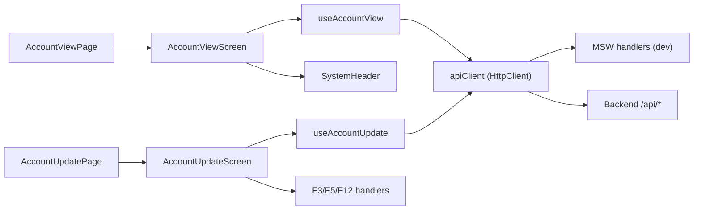
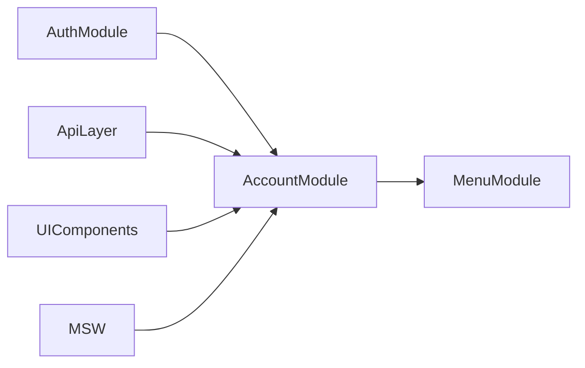

# 💳 ACCOUNT - Módulo de Consulta y Actualización de Cuentas

**Módulo ID**: `account`  
**Versión**: 1.0  
**Última actualización**: 2026-01-27  
**Propósito**: Proveer una vista operacional para consultar el estado completo de una cuenta de tarjeta de crédito y editar sus datos financieros y del cliente con validaciones transaccionales y seguridad de datos sensibles.

---

## 📋 Descripción General

El módulo ACCOUNT es la puerta de entrada para que el personal de back-office consulte, valide y actualice cuentas de clientes. Está compuesto por dos pantallas (Account Viewer y Account Update) que comparten los mismos hooks y servicios REST, garantizando que la información se mantenga sincronizada y enmascarada cuando corresponde.

### Responsabilidades Principales
- ✅ Búsqueda por Account ID de 11 dígitos con validaciones en el frontend y backend (locks en CardXref → Account → Customer)
- ✅ Visualización de información financiera (límites, balances, ciclos) con mascarado de SSN y número de tarjeta, opcionalmente revelable
- ✅ Actualización transaccional de datos de cuenta y cliente con detección de cambios y confirmación del usuario
- ✅ Feedback inmediato con indicadores de estado (`Chip`), mensajes contextuales (`Alert`) y estados de carga (`LoadingSpinner`)
- ✅ Soporte de escenarios de desarrollo mediante cuentas de prueba y errores simulados (MSW)

---

## 🏗️ Arquitectura Técnica

### Componentes clave
1. **`AccountViewPage.tsx`** (ubicación: `/app/pages/AccountViewPage.tsx`)  
   - Verifica `userRole` en `localStorage` y redirige a `/login` si no existe.  
   - Llama a `initializeScreen` del hook `useAccountView` para precargar metadata y activa `handleExit` que vuelve al menú correspondiente.  
2. **`AccountUpdatePage.tsx`** (`/app/pages/AccountUpdatePage.tsx`)  
   - Limpia datos al montar con `clearData` y usa `useAccountUpdate` para preparar la pantalla.  
   - Expone `hasChanges`, `loading`, `error` y callbacks (`searchAccount`, `updateAccount`, `updateLocalData`, `resetForm`, `clearData`) al `AccountUpdateScreen`.  
3. **`AccountViewScreen.tsx`** (`/app/components/account/AccountViewScreen.tsx`)  
   - Formulario de búsqueda con validación de 11 dígitos (`setFieldError`, regex numérico) y botón que ejecuta `onSearch`.  
   - Botón “Show Test Accounts” que despliega un `Collapse` con los IDs definidos en el array `testAccounts` (11111111111, 22222222222, 33333333333, 44444444444).  
   - Tarjetas responsivas con `Card`, `Stack` y `Typography` que muestran fechas formateadas, límites financieros, SSN/card number enmascarados (toggle `showSensitiveData`).  
   - Indicadores de estado (`Chip`) y validaciones (mensajes de `Alert` para `error`, `data.errorMessage` o `infoMessage`).  
   - Hook de teclado (`handleKeyDown`) que responde a F3/Escape (salir), y `LoadingSpinner` dentro del botón Search.  
4. **`AccountUpdateScreen.tsx`** (`/app/components/account/AccountUpdateScreen.tsx`)  
   - Campo de búsqueda y botón Search idénticos al viewer, con validación, `LoadingSpinner`, `Alert` y `Chip` “Unsaved Changes”.  
   - Toggle `Edit Mode` mediante `Switch`. Cuando está activo habilita `TextField`s para “Account Information” y “Customer Information” organizados en `Grid`.  
   - Validaciones locales (ZIP, FICO, credit limits) que alimentan `validationErrors` antes de permitir guardar.  
   - Botones “Save Changes” y “Reset” que aparecen sólo en modo edición; al guardar abre un `Dialog` de confirmación.  
   - Footer con atajos (ENTER = buscar, F5 = guardar, F12 = reset, F3 = salir).  
5. **`useAccountView`** (`/app/hooks/useAccountView.ts`)  
   - Usa `useMutation` para llamar a `GET /api/account-view?accountId=...` (convierte a número, rellena con `padStart(11, '0')`).  
   - `initializeScreen` invoca `/api/account-view/initialize`, detecta respuestas MSW o backend real y establece `data`.  
   - Expone `data`, `loading`, `error`, `searchAccount`, `initializeScreen` y `clearData`.  
6. **`useAccountUpdate`** (`/app/hooks/useAccountUpdate.ts`)  
   - Primer `useMutation` obtiene `/accounts/{accountId}` y guarda `accountData`/`originalData`.  
   - Segundo `useMutation` realiza el `PUT /accounts/{accountId}` y, si `response.success` es true, reescribe los estados y `hasChanges`.  
   - `updateLocalData` actualiza campos en memoria y compara con `originalData` usando `JSON.stringify` para activar `hasChanges`.  
   - Expone `resetForm` para volver a datos originales y `clearData` para limpiar al cerrar/montar la pantalla.  
7. **`apiClient` y `HttpClient`** (`/app/services/api.ts`)  
   - `API_BASE_URL = import.meta.env.VITE_API_BASE_URL || "/api"` y cabecera `Content-Type: application/json`.  
   - Agrega `Authorization: Bearer ${localStorage.getItem("auth-token")}` cuando existe token.  
   - Timeout por defecto 10 segundos, loguea la respuesta y detecta si el backend devuelve `currentDate/currentTime/transactionId`.  
8. **`useMutation` (desde `useApi.ts`)**  
   - Aborta llamadas previas, maneja `ApiResponse` y `ApiError`, detecta respuestas MSW (`success/data`) o backend real (`currentDate`).  
   - Lanza errores explicativos que llegan hasta `AccountViewScreen`/`AccountUpdateScreen` para mostrarlos en UI.  
9. **MSW (`accountHandlers`, `accountUpdateHandlers`)**  
   - Simulan los endpoints con delays (800ms al buscar, 1200ms al actualizar) y validan los mismos campos que la UI.  
   - Se cubren errores de “account not provided”, formato inválido, cuenta no encontrada, validaciones del PUT y un caso 500 (account `99999999999`).  

### 🧭 Diagrama de flujo del módulo



---

## 🔗 APIs Documentadas

### GET `/api/account-view?accountId={accountId}`
- **Uso**: Ejecutado desde `useAccountView.searchAccount`. Convierte la entrada a número, rellena 11 dígitos y llama al endpoint con query string.  
- **Respuestas**:
  - **200 (success)**: devuelve un objeto `AccountViewResponse` con fechas, transactionId y todos los datos de cuenta/cliente.  
  - **400/422 (MSW)**: si falta `accountId`, tiene menos de 11 dígitos o no se encuentra la cuenta, devuelve `data.errorMessage` con mensajes como `"Account number not provided"`, `"Account Filter must be a non-zero 11 digit number"` o `"Account:123... not found in Cross ref file"`.  
  - **Campos clave**: `accountStatus`, `currentBalance`, `creditLimit`, `customerSsn`, `cardNumber`, `infoMessage`, `foundAccountInMaster`, `foundCustomerInMaster`.
  - **Ejemplo de response (cuenta 11111111111)**:
    ```json
    {
      "currentDate": "12/15/24",
      "currentTime": "14:30:25",
      "transactionId": "CAVW",
      "programName": "COACTVWC",
      "accountId": 11111111111,
      "accountStatus": "Y",
      "currentBalance": 1250.75,
      "creditLimit": 5000.0,
      "groupId": "PREMIUM",
      "customerSsn": "123-45-6789",
      "infoMessage": "Displaying details of given Account",
      "inputValid": true,
      "foundAccountInMaster": true
    }
    ```

### GET `/api/account-view/initialize`
- **Uso**: `useAccountView.initializeScreen` para precargar metadata sin ingresar accountId.  
- **Response**: objeto parcial `AccountViewResponse` con `currentDate`, `currentTime`, `transactionId`, `programName`, `infoMessage: "Enter or update id of account to display"` e indicadores de validación (`inputValid: true`).  

### GET `/api/accounts/{accountId}`
- **Uso**: `useAccountUpdate.searchAccount` prepara el formulario de edición.  
- **Response**: `AccountUpdateData` completo (account + customer). MSW valida `accountId` y responde `404` si no lo encuentra o `success: true` con `data`.  

### PUT `/api/accounts/{accountId}`
- **Uso**: `useAccountUpdate.updateAccount` envía el objeto `AccountUpdateData` modificado.  
- **Validaciones (MSW)**: `activeStatus` debe ser `'Y'` o `'N'`, `creditLimit >= 0`, ZIP `^\d{5}(-\d{4})?$`, y `ficoScore` en 300-850.  
- **Responses**:
  - `200` con `{ success: true, data: AccountUpdateData, message: "Changes committed to database" }` cuando pasa validaciones.  
  - `400` con `errors: string[]` cuando la validación falla.  
  - `500` simulado para `/accounts/99999999999` con `error: "Changes unsuccessful: Database connection timeout"`.  

---

## 📊 Modelos de Datos

### `AccountViewResponse` (`/app/types/account.ts`)
```typescript
interface AccountViewResponse {
  currentDate: string;
  currentTime: string;
  transactionId: string;
  accountId?: number;
  accountStatus?: string;
  currentBalance?: number;
  creditLimit?: number;
  customerSsn?: string;
  firstName?: string;
  lastName?: string;
  cardNumber?: string;
  infoMessage?: string;
  errorMessage?: string;
  inputValid: boolean;
  foundAccountInMaster?: boolean;
}
```

### `AccountUpdateData` y `AccountUpdateResponse` (`/app/types/accountUpdate.ts`)
```typescript
interface AccountUpdateData {
  accountId: number;
  activeStatus: string;
  creditLimit: number;
  cashCreditLimit: number;
  groupId: string;
  customerId: number;
  firstName: string;
  lastName: string;
  ssn: string;
  zipCode: string;
  stateCode: string;
  countryCode: string;
  ficoScore: number;
  eftAccountId: string;
  primaryCardIndicator: string;
}

interface AccountUpdateResponse {
  success: boolean;
  data?: AccountUpdateData;
  message?: string;
  errors?: string[];
}
```

---

## 📋 Reglas de Negocio

1. **ID de cuenta**: 11 dígitos numéricos, no puede ser `00000000000`. La pantalla falla con mensajes específico (ver `accountHandlers`).  
2. **Status**: solo `'Y'` (active) o `'N'` (inactive). La pantalla de edición habilita el dropdown y el backend rechaza otros valores.  
3. **Crédito y ciclos**: el `availableCredit` implícito resulta de `creditLimit - currentBalance`. `cashCreditLimit` queda alineado con los restos de ciclo.  
4. **Datos sensibles**: el SSN y el número de tarjeta siempre se enmascaran, salvo que el usuario active “Show Sensitive Data”.  
5. **Validaciones del PUT**: ZIP y FICO se validan dos veces (frontend y MSW/backend), con mensajes y bloqueo de botón Save si hay errores.  
6. **Transaccionalidad**: `onUpdate` solo se ejecuta después de confirmar con el dialog; si el backend devuelve error se muestra `Alert` con el mensaje.  

---

## 🎯 Historias de Usuario

1. **Simple (1-2 pts)**:  
   `Como representante back-office, quiero buscar una cuenta por su Account ID de 11 dígitos para ver el saldo y el grupo asociado sin salir del flujo principal.`  
2. **Medio (3-5 pts)**:  
   `Como administrador, quiero editar el FICO score y el ZIP del cliente con validaciones en línea para mantener la información regulatoria actualizada.`  
3. **Complejo (5-8 pts)**:  
   `Como oficial de cumplimiento, quiero que el sistema registre qué usuario desactivó el modo edición, muestre cambios y bloquee la actualización si el FICO queda fuera de rango o si el backend retorna 500.`  

---

## ⚡ Factores de Aceleración de Desarrollo

- `useAccountView` y `useAccountUpdate`: encapsulan la lógica de `useMutation`, `apiClient`, `loading`, `error` y detección de cambios.  
- `SystemHeader` + `LoadingSpinner`: patrones reutilizados para mantener consistencia en pantallas operativas.  
- Material UI (`Grid`, `Card`, `Chip`, `TextField`, `Switch`, `Dialog`) facilita la construcción rápida de formularios responsivos.  
- `apiClient` + `useMutation` ya diferencian entre respuestas MSW y backend real, por lo que nuevas pantallas solo requieren definir el endpoint y los DTO.  
- MSW (`accountHandlers`, `accountUpdateHandlers`) ya simula delays, errores y tours de validación, reduciendo el tiempo de QA para nuevos workflows.  

---

## 📌 Patrones de Criterios de Aceptación

- **Autenticación**: Dado un `userRole` en `localStorage`, cuando abro Account Viewer, entonces el sistema carga metadata y evita el acceso si no existe rol.  
- **Validación**: Dado que ingreso `accountId` incompleto, cuando presiono Search, entonces aparece el `Alert` con “Account number must be a non zero 11 digit number”.  
- **Rendimiento**: Dado que la cuenta existe, cuando la búsqueda completa, entonces la pantalla muestra datos en menos de 500 ms en ambiente de QA simulado (MSW usa ~800 ms).  
- **Manejo de errores**: Dado que actualizo `activeStatus` con un valor inválido, cuando guardo, entonces aparece el error del backend y no se cierra el diálogo.  
- **Confirmación**: Dado que hago Save con `hasChanges === true`, cuando confirmo el diálogo, entonces se dispara `PUT /accounts/{accountId}` con todos los datos actuales.  

---

## ⚡ Presupuestos de Performance

- **Account View**: Search debe resolver en <500 ms (P95), aunque MSW usa 800 ms para emular latencia real.  
- **Account Update**: PUT debe responder en <800 ms en producción; MSW simula 1.2 s para exponer errores.  
- **Time-outs**: `HttpClient` cancela después de 10 s y muestra `Request timeout`.  
- **Throughput**: La UI está preparada para múltiples búsquedas consecutivas (se abortan las llamadas anteriores).  

---

## 🚨 Riesgos y Deuda Técnica

1. **Mock vs. backend real**: MSW genera errores específicos (account 99999999999) que deben ser validados nuevamente cuando el backend real esté disponible.  
2. **Datos sensibles en memoria**: `showSensitiveData` deja SSN/card en estado; es crítico limpiar el estado (`clearData`) cuando se sale.  
3. **Actualización concurrente**: No hay locking real; si dos usuarios editan el mismo Account, el último overridea sin alerta. Se podría agregar versionado/ETag.  
4. **Auditoría**: No se registra quién presiona Save. Futuro: introducir un Audit Trail del backend y mostrarlo en la pantalla.  

---

## ✅ Pruebas y Mocks

- `accountHandlers` cubre GET `/api/account-view`, `/api/account-view/initialize`, `/api/account-view/process`, y las respuestas de error con `success: true` incluyendo `infoMessage`/`errorMessage`.  
- `accountUpdateHandlers` cubre el GET/PUT de `/api/accounts`, valida ZIP/FICO/activeStatus y fuerza un error 500 en `99999999999`.  
- Las pantallas consumen estos mocks y también detectan la propiedad `success` para decidir si muestran datos o `Alert`.  
- `useAccountView.clearData` y `useAccountUpdate.clearData` se usan para evitar datos residuales al navegar entre módulos.  

---

## 🔄 Dependencias

- **Auth Module**: necesita token (`localStorage["auth-token"]`) y `userRole` para mostrar/ocultar el módulo.  
- **Material UI (MUI)**: para `Grid`, `Card`, `TextField`, `Chip`, `Dialog`, `Switch`, `LoadingSpinner`.  
- **React Router (`useNavigate`)**: para redirigir a `/login`, `/menu/main` o `/menu/admin`.  
- **apiClient + useMutation**: capa compartida de llamadas HTTP y manejo de errores.  
- **MSW**: despliega el comportamiento offline y permite probar validaciones sin backend.  
- **Components compartidos**: `SystemHeader`, `LoadingSpinner`, `Menu` (ruta y contexto).  

### 🗺️ Diagrama de dependencias



---

## 🧭 Secuencia Recomendada para Historias

1. **Prerequisitos**: validar que `Auth` autentica el usuario y entrega token antes de mostrar el menú de `Account`.  
2. **Flujo base**: comenzar por `Account View` (consulta) → `Account Update` (edición).  
3. **Testing**: aprovechar los test accounts (11111111111…) y el mock de error 500 para verificar alertas.  

---

## 🧾 Lista de Tareas

[x] Documentar auditoría del módulo en `docs/modules/account/account-overview.md`  
[ ] Validar contratos reales con backend (reemplazar MSW por endpoints reales)  
[ ] Incluir trazabilidad de cambios / versión en Account Update  

---

## 📈 Métricas de Éxito

- ✅ **Adopción**: el 90 % de los agentes de apoyo usan el módulo en la primera interacción para verificar cuentas.  
- ⚡ **Rendimiento**: búsqueda < 500 ms (P95) y actualización < 800 ms.  
- ✅ **Calidad**: 0 errores de validación sin manejo en UI (Zip, FICO, activeStatus).  
- 🔒 **Seguridad**: SSN/card ocultos por defecto y solo visibles con el toggle explícito.  

---

## 📚 Enlaces

- `docs/site/modules/accounts/index.html` - Guía corta para desarrolladores.  
- `docs/system-overview.md#-account---gestión-de-cuentas` - Catálogo general del módulo.
