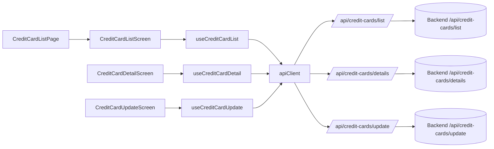
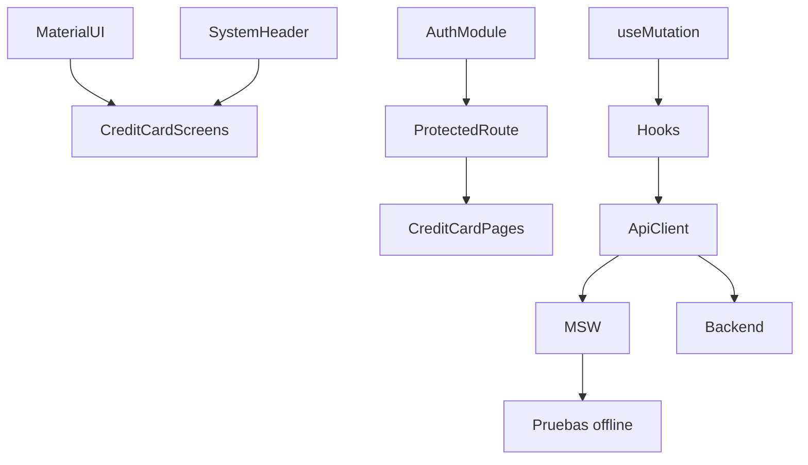

# 💳 CREDIT CARD - Administración de Tarjetas de Crédito

**Módulo ID**: `creditCard`  
**Versión**: 1.0  
**Última actualización**: 2026-02-10  
**Propósito**: Entregar la experiencia operativa completa para listar, inspeccionar y actualizar tarjetas de crédito conectadas a una cuenta, replicando los flujos legacy (F3/F7/F8/ENTER) y facilitando pruebas con MSW.

---

## 📋 Descripción general
El módulo CREDIT CARD se compone de tres pantallas protegidas (`/cards/list`, `/cards/view`, `/cards/update`) que consumen hooks compartidos y el `apiClient` para comunicarse con `/api/credit-cards/*`. Todos usan `SystemHeader` (transacciones CCLI, CCDL, CCUP) y patrones de Material UI (Cards, Grid, Chip, Dialog). Los pasos principales son:

1. **Lista**: `CreditCardListScreen.tsx` permite buscar con accountId de 11 dígitos o cardNumber de 16 dígitos, mostrar botones `S`/`U` y paginar con F7/F8. Solo un registro puede estar seleccionado; ENTER dispara la vista o edición.
2. **Detalle**: `CreditCardDetailScreen.tsx` provee búsqueda manual y autocompletado cuando viene de la lista, muestra estado con Chips y ofrece el toggle de `Test Data` solo en desarrollo.
3. **Actualización**: `CreditCardUpdateScreen.tsx` valida nombres, status (`A`/`I`), fechas de expiración y muestra un `Dialog` de confirmación antes de disparar el `PUT` final.

### Responsabilidades principales
- Replicar el flujo batch de tarjetas: búsqueda con filtros, selección única y navegación guiada por teclas (F3 exit, F7/F8 paginación, ENTER para continuar, F5 guardar, F12 cancelar).
- Blindar validaciones en frontend (regex account/card, nombres alfabéticos, fechas) y reflejarlas en MSW/ backend para evitar regresiones.
- Mostrar data sensible (CVV, status) en componentes bien enmascarados y proveer estados visuales (`Chip`, `Alert`) que guían al operador.
- Proveer datos de prueba (arreglos en `CreditCardListScreen.tsx`, `CreditCardDetailScreen.tsx`, `CreditCardUpdateScreen.tsx`) sincronizados con `mockCardDetails` y `mockCardUpdateDetails`.

---

## 🏗️ Arquitectura técnica
### Componentes clave
1. `CreditCardListPage.tsx` → `CreditCardListScreen` (ruta `/cards/list`, protegido por `ProtectedRoute`). Realiza validaciones en `handleInputChange`, usa `LoadingSpinner` en el botón Search y expone `handleTestDataSelect` para los seis escenarios definidos.
2. `useCreditCardList.ts` (hook) encapsula `useMutation`, controla `pageSize=7`, filtros, `selectedCards`, `handleProcessSelection` → navega a `/cards/view` o `/cards/update` con `navigate` y `state`. Requiere `User-Type` header cuando se expone `creditCardApi.listCreditCards`.
3. `CreditCardDetailScreen.tsx` + `useCreditCardDetail.ts`: auto-busca cuando recibe `state` desde la lista, muestra Alerts (info/error), habilita `Retry`, y formatea expiry por hook `formatExpiryDate`.
4. `CreditCardUpdateScreen.tsx` + `useCreditCardUpdate.ts`: lifecycle `changeAction` (NOT_FETCHED → SHOW_DETAILS → CHANGES_NOT_OK → CHANGES_OK_NOT_CONFIRMED → CHANGES_OKAYED_AND_DONE), `Dialog` de confirmación, validaciones de `activeStatus` con `mapBackendStatusToUI`, y resets con F12.
5. `apiClient` + `useMutation`: `useMutation` maneja respuestas de MSW (`ApiResponse`) o backend real, detecta `success/error` y lanza errores personalizados (`ApiError`).
6. MSW handlers: `creditCardHandlers`, `creditCardDetailHandlers`, `creditCardUpdateHandlers` replican validaciones COBOL y proveen delays (600-800 ms) para entrenar criterios de aceptación.

### 🧭 Diagrama de flujo del módulo


### 🔄 Diagrama de dependencias


---

## 🔗 APIs documentadas
| Endpoint | Descripción | Payload clave | Respuesta esperada |
| --- | --- | --- | --- |
| `POST /api/credit-cards/list` | Lista tarjetas filtrando por `accountId` (11 dígitos) o `cardNumber` (16 dígitos); `User-Type` header controla si `accountId` es obligatorio. | `{ accountId?, cardNumber?, pageNumber: 1, pageSize: 7 }` | `CreditCardListResponse` (content, totalElements, first/last) con delays de 800 ms. |
| `POST /api/credit-cards/details` | Devuelve card detail para `accountId`+`cardNumber`; usado por `CreditCardDetailScreen`. | `{ accountId: number, cardNumber: string }` | `CreditCardDetailResponse` con `success`, `infoMessage`, `errorMessage`, `cvvCode?`. |
| `POST /api/credit-cards/search` | Busca los datos actuales antes de editar. | `{ accountId: number, cardNumber: string }` | `CreditCardUpdateResponse` (oldDetails) con campos en mayúsculas y `activeStatus` en el enum del backend. |
| `PUT /api/credit-cards/update` | Persiste los cambios (embossedName, activeStatus, expiryMonth/Year). | `{ accountId, cardNumber, embossedName, activeStatus: 'A'|'I', expiryMonth, expiryYear, expiryDay }` | `CreditCardUpdateResponse` con `infoMessage: 'Changes committed to database'`. |
| `POST /api/credit-cards/update/reset-test-data` | Reset de datos de prueba (solo dev). | — | `{ success: true, message: 'Test data reset successfully' }`. |
| `GET /api/credit-cards/update/test-cards` | Lista tarjetas de prueba para QA. | — | `{ data: [ { accountId, cardNumber, statusDescription } ] }`. |

### Ejemplo de flujo de request (list)
```json
{
  "accountId": "12345678901",
  "pageNumber": 1,
  "pageSize": 7
}
```
Respuesta (simplificada):
```json
{
  "content": [ { "accountNumber": "12345678901", "cardNumber": "4532123456789012", "cardStatus": "ACTIVE" } ],
  "totalElements": 2,
  "totalPages": 1,
  "first": true,
  "last": true
}
```

---

## 🔢 Modelos de datos
```typescript
interface CreditCard {
  accountNumber: string;
  cardNumber: string;
  cardStatus: 'ACTIVE' | 'INACTIVE' | 'BLOCKED' | 'EXPIRED';
}

interface CreditCardFilter {
  accountId?: string;
  cardNumber?: string;
  pageNumber?: number;
  pageSize?: number;
}

interface CreditCardListResponse {
  content: CreditCard[];
  totalElements: number;
  totalPages: number;
  number: number;
  size: number;
  first: boolean;
  last: boolean;
  numberOfElements: number;
}

interface CreditCardDetailRequest { accountId: string; cardNumber: string; }
interface CreditCardDetailResponse {
  accountId: number;
  cardNumber: string;
  cvvCode?: number;
  embossedName: string;
  activeStatus: 'ACTIVE' | 'INACTIVE' | 'BLOCKED' | 'EXPIRED';
  expiryMonth: string;
  expiryYear: string;
  errorMessage?: string;
  infoMessage?: string;
  success: boolean;
}

interface CreditCardUpdateRequest {
  accountId: string;
  cardNumber: string;
  embossedName: string;
  activeStatus: 'A' | 'I';
  expiryMonth: string;
  expiryYear: string;
  expiryDay?: string;
}

interface CreditCardUpdateResponse {
  accountId: number;
  cardNumber: string;
  cvvCode?: number;
  embossedName: string;
  activeStatus: string;
  expiryMonth: string;
  expiryYear: string;
  errorMessage?: string;
  infoMessage?: string;
  success: boolean;
}

interface CreditCardUpdateState {
  changeAction: 'NOT_FETCHED' | 'SHOW_DETAILS' | 'CHANGES_NOT_OK' | 'CHANGES_OK_NOT_CONFIRMED' | 'CHANGES_OKAYED_AND_DONE' | 'CHANGES_FAILED';
  oldDetails?: CreditCardUpdateResponse;
  newDetails?: CreditCardUpdateRequest;
  validationErrors: Record<string, string>;
}
```

---

## 📋 Reglas de negocio confirmadas
1. `accountId` debe tener 11 dígitos numéricos, no puede ser `00000000000`; se valida en `useCreditCardList`, `useCreditCardDetail` y `useCreditCardUpdate`.
2. `cardNumber` debe tener exactamente 16 dígitos, solo numéricos y se limita en los campos de texto.
3. Solo tarjetas con `activeStatus = 'ACTIVE'` (o `A` en el update) pueden considerarse válidas para compra; los `Chip` muestran `EXPIRED`, `INACTIVE`, `BLOCKED` cuando aplica.
4. `embossedName` acepta letras y espacios (máx. 50), se transforma a mayúsculas antes del `PUT`.
5. Expiry Month/Year no pueden ser pasados; si el año es el actual, el mes debe ser >= mes actual.
6. Solo se selecciona un registro a la vez, imitando la tecla `S`/`U` del COBOL y obligando a ENTER para continuar.

---

## 🎯 Historias de Usuario recomendadas
1. **Simple (1-2 pts)**: Como agente back-office, quiero buscar tarjetas por Account ID para ver cuántos plásticos tiene una cuenta y su estado actual.
2. **Medio (3-5 pts)**: Como supervisor, quiero editar el nombre embosado y el status de una tarjeta validando el formato y la fecha de expiración antes de persistir los cambios.
3. **Complejo (5-8 pts)**: Como oficial de cumplimiento, quiero que se registre el flujo completo (selección, cambios validados, confirmación y respuesta del backend) y que se muestre el mensaje de error exacto cuando MSW/ backend devuelve `errorMessage`.

---

## ⚡ Factores de aceleración de desarrollo
- `useCreditCardList`, `useCreditCardDetail`, `useCreditCardUpdate` encapsulan lógica de `useMutation`, validaciones, `LoadingSpinner` y `navigate`, dejando la UI libre para enfocarse en layout.
- Sistemas de teclas (F3/F5/F7/F8/F12/ENTER) están implementados y documentados en cada pantalla para replicar la experiencia legacy.
- MSW (`creditCardHandlers`, `creditCardDetailHandlers`, `creditCardUpdateHandlers`) provee validaciones idénticas al backend, delays métricos y datos de prueba (cuentas 12345678901, 11111111111, 22222222222...).
- Componentes base `SystemHeader`, `LoadingSpinner`, `Dialog` y `Chip` con MUI permiten enfocarse en contenido sin reconstruir estilos.

---

## 📌 Patrones de criterios de aceptación
- **Validación**: Dado un `cardNumber` de 15 dígitos, cuando presiono Search, entonces aparece el helper text y el mensaje de error `Card number if supplied must be a 16 digit number`.
- **Interacción**: Dado que hay varios resultados, cuando presiono F8, entonces la pantalla avanza una página y actualiza el chip de paginación.
- **Selección**: Dado que selecciono una tarjeta con `S`, cuando presiono ENTER, entonces se navega a `/cards/view` con `state` conteniendo `accountNumber` y `cardNumber`.
- **Confirmación**: Dado que validé cambios y presiono F5, entonces aparece el diálogo de confirmación y, tras aceptar, se llama a `PUT /api/credit-cards/update` con la misma `accountId` y `cardNumber`.
- **Errores del backend**: Dado que el backend responde `success: false` con `errorMessage`, cuando la UI recibe la respuesta, entonces muestra un `Alert` con el texto recibido y no cierra el diálogo.

---

## ⚡ Presupuestos de performance
- `Search` en `/cards/list` (pageSize 7) debe responder en <500 ms (P95) en producción; MSW simula 800 ms como lineamiento de QA.
- `Detail` y `Update` usan timeouts de `apiClient` (10 s) y reintentos de `useMutation` pueden ser habilitados si se expone el parámetro.
- `PUT /api/credit-cards/update` debe terminar en <800 ms (MSW: 800 ms) y mostrar `Changes committed to database`.
- Las tablas nunca cargan más de 7 filas para mantener consistencia con el COBOL original y minimizar repaints.

---

## 🚨 Riesgos y deuda técnica
1. **Dependencia de MSW**: Sin backend real no se valida la autenticación del token. Requiere comparar logs cuando se habilite la API.
2. **Datos sensibles en memoria**: `cvvCode` y `cardNumber` se guardan en estado; los hooks llaman a `setState` (modo `clearData`) para limpiar al salir.
3. **Selección única**: Forzar una sola selección puede causar que una automatización busque varios registros; documentar bien el flujo para QA.
4. **Audit trail**: No se guarda quién realizó el cambio; se sugiere registrar `userId` en el payload cuando el backend lo soporte.

---

## ✅ Pruebas & mocks
- `app/mocks/creditCardHandlers.ts`: valida account/card, userType, patch 7 filas, simula errores 400/401.
- `app/mocks/creditCardDetailHandlers.ts`: replican validaciones (accountId 11 dígitos, cardNumber 16 dígitos) y devuelven `mockCardDetails`.
- `app/mocks/creditCardUpdateHandlers.ts`: cubre búsqueda (`/search`), persistencia (`/update`), reset de test data y endpoints auxiliares (`/update/test-cards`).
- Los handlers usan `HttpResponse.json` con `success` y `infoMessage`, lo cual se intercepta en `useMutation` y `useCreditCardUpdate`.

---

## 🔄 Dependencias
- **Auth Module**: el token y `userRole` de `localStorage` se requieren para mostrar la navegación y habilitar `ProtectedRoute`.
- **Material UI (MUI)**: `Grid`, `Card`, `Chip`, `Dialog`, `TextField`, `Stack`, `Button`, `Alert` y los iconos `CreditCard`, `ExitToApp`, `Info`.
- **React Router**: `ProtectedRoute`, `useNavigate`, `useLocation` y el mapa de rutas en `App.tsx` (`/cards/list`, `/cards/view`, `/cards/update`).
- **apiClient + useMutation**: comparten `Authorization` header y `AbortController` entre los tres hooks.
- **SystemHeader + LoadingSpinner**: presentes en las tres pantallas para mantener contextos transaccionales.
- **MSW**: simula toda la capa HTTP y redefine `mockCardDetails`/`mockCardUpdateDetails` para QA.

---

## 🧭 Secuencia recomendada para historias
1. Validar el login y token (`Auth` + `ProtectedRoute`).
2. Implementar `/cards/list` y `useCreditCardList` (búsqueda, paginación, test data).  
3. Agregar `/cards/view` y `useCreditCardDetail` con la auto-búsqueda desde `state`.  
4. Completar `/cards/update`, `useCreditCardUpdate`, validaciones y diálogo de confirmación.
5. Sincronizar con backend real y verificar `PUT /api/credit-cards/update` antes de QA.

---

## 🧾 Lista de tareas
[x] DS3CA-4: Documentar el módulo CREDIT CARD siguiendo `TEMPLATE_DOC.txt` y enlazarlo desde la landing page.  
[ ] Validar contratos del backend real para `/api/credit-cards/*`.  
[ ] Registrar indicadores de auditoría (quién confirmó el `PUT`).

---

## 📈 Métricas de éxito
- **Adopción**: ≥90 % de agentes back-office usan `/cards/list` en la primera visita de cada turno.  
- **Rendimiento**: `Search` <500 ms (P95) y `Update` <800 ms cuando el backend responde.  
- **Calidad**: 0 tickets de regresión en validaciones de account/card y `errorMessage` visibles.  
- **Seguridad**: Ningún CVV se muestra sin que se solicite explícitamente en la pantalla de detalle.

---

## 📚 Enlaces
- `docs/site/modules/credit-card/index.html` - Guía gráfica del módulo con patrones de historias.  
- `docs/system-overview.md#-credit-card---gestión-de-tarjetas-de-crédito` - Catálogo maestro.
