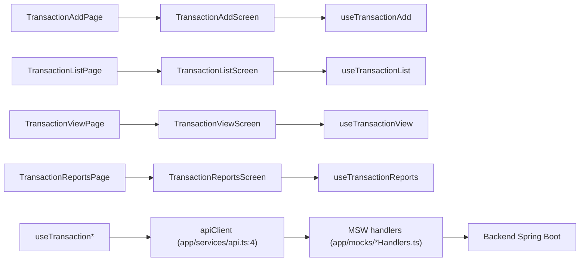
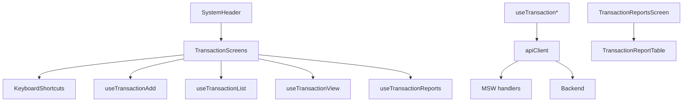

# 💸 TRANSACTION - Gestión de Transacciones

**Módulo ID**: `transaction`  
**Versión**: 1.0  
**Última actualización**: 2026-02-13  
**Propósito**: Registrar transacciones manuales, consultar movimientos específicos y generar reportes consolidados con las mismas reglas y metadatos que el backend heredado.

---

## 📋 Descripción general

El módulo TRANSACTION expone cuatro rutas protegidas (`/transactions/add`, `/transactions/list`, `/transactions/view/:transactionId?`, `/reports/transactions`) que se cargan perezosamente desde `app/App.tsx:20-149` y comparten los mismos patrones de validación, `SystemHeader` y `useMutation` del resto de la aplicación. Cada pantalla consume un hook dedicado que encapsula la interacción con `apiClient`, el estado de carga/errores y los atajos de teclado (F3=salir, F5/F7/F8 en pantallas de lista, ENTER para búsquedas y confirmaciones) heredados del flujo COBOL.

### Responsabilidades principales

1. **Alta de transacción** (`TransactionAddScreen` + `useTransactionAdd`, `app/components/transaction/TransactionAddScreen.tsx:1`, `app/hooks/useTransactionAdd.ts:1`): formulario dividido en pasos (datos, confirmación), que valida identificadores (account/card), códigos de tipo/categoría, monto límite `±99,999,999.99`, fechas, datos del comerciante y una confirmación Y/N antes de invocar `POST /api/transactions`. Incluye ayuda visual (`Chip`, test data, golden rules) y atajos para copiar la última transacción o limpiar el formulario.

2. **Lista paginada de transacciones** (`TransactionListScreen` + `useTransactionList`, `app/components/transaction/TransactionListScreen.tsx:1`, `app/hooks/useTransactionList.ts:1`): tabla enriquecida que muestra fecha, descripción, monto y permite navegar con F7/F8, buscar por Transaction ID y seleccionar la transacción activa (acción `S`) para saltar a la vista. El hook administra `firstTransactionId`/`lastTransactionId`, `hasNextPage`/`hasPreviousPage` y las llamadas a `/transactions/list`, `/transactions/next-page` y `/transactions/previous-page`.

3. **Consulta de transacción** (`TransactionViewScreen` + `useTransactionView`, `app/components/transaction/TransactionViewScreen.tsx:1`, `app/hooks/useTransactionView.ts:1`): busca por Transaction ID, limpia la pantalla (`/transaction/clear`) y permite navegar de regreso a la lista mostrando encabezados (fecha, programa, nombre de transacción) y detalles del comerciante, monto y timestamps procesados.

4. **Reportes transaccionales** (`TransactionReportsScreen` + `TransactionReportTable` + `useTransactionReports`, `app/components/transaction/TransactionReportsScreen.tsx:1`, `app/components/transaction/TransactionReportTable.tsx:1`, `app/hooks/useTransactionReports.ts:1`): permite generar reportes mensual, anual o personalizados; requiere confirmación Y/N, despliega `accountGroups` con totales y ofrece descarga simulada tipo PDF (`.txt`) con totales por cuenta y gran total.

## 🏗️ Arquitectura técnica

### Componentes clave

1. **Páginas y pantallas**: Cada ruta es un `ProtectedRoute` que renderiza `TransactionAddPage`, `TransactionListPage`, `TransactionViewPage` o `TransactionReportsPage`, los cuales inyectan la pantalla correspondiente y los `snackbars` de éxito/error (`app/pages/TransactionAddPage.tsx:1`, `app/pages/TransactionListPage.tsx:1`, `app/pages/TransactionViewPage.tsx:1`, `app/pages/TransactionReportsPage.tsx:1`).
2. **Hooks**: `useTransactionAdd`, `useTransactionList`, `useTransactionView` y `useTransactionReports` usan `useMutation` (desde `app/hooks/useApi.ts`) para pegar directamente con `apiClient` (`app/services/api.ts:4`) y traducir respuestas MSW/backend a validaciones en pantalla.
3. **Layouts compartidos**: Todas las pantallas envuelven el contenido en `SystemHeader` (`app/components/layout/SystemHeader.tsx:1`) para mostrar `transactionId`, `programName` y atajos, y usan `LoadingSpinner`/`Alert` para reflejar el estado de las mutaciones.
4. **Datos de prueba y mocks**: Los handlers de MSW (`app/mocks/transactionAddHandlers.ts:3`, `app/mocks/transactionListHandlers.ts:3`, `app/mocks/transactionViewHandlers.ts:3`, `app/mocks/transactionReportsHandlers.ts:3`) replican validaciones del backend legacy, generan IDs incrementales, simulan errores (`400`, `500`) y alimentan los escenarios “development only” de la UI.

### 🧭 Diagrama de flujo del módulo

### 🔄 Diagrama de dependencias

---

## 🔗 APIs documentadas

| Endpoint | Método | Uso clave | Payload / Respuesta |
| --- | --- | --- | --- |
| `/api/transactions` | `POST` | Alta manual desde `TransactionAddScreen` tras validación + confirmación Y/N | Request = `TransactionAddRequest` (accountId/cardNumber, type/cat/source/description, monto, fechas, datos del merchant, confirmation). Response = `TransactionAddResponse` con `success`, `transactionId`, `message`. |
| `/api/transactions/list` | `POST` | Carga inicial y búsquedas por Transaction ID desde la tabla | Request = `{ transactionId?, pageNumber: 1 }`, Response incluye `transactions[]`, `currentPage`, `hasNextPage`, `hasPreviousPage`, `firstTransactionId?`, `lastTransactionId?`. |
| `/api/transactions/next-page` | `POST` | Paginación F8 desde el hook `useTransactionList` | Request = `{ pageNumber, transactionId: lastTransactionId }`, mismo esquema de respuesta que `/list`. |
| `/api/transactions/previous-page` | `POST` | Paginación F7 para retroceder | Request = `{ pageNumber, transactionId: firstTransactionId }`, respuesta similar. |
| `/api/transaction-view/search` | `GET` | Obtiene detalles de una transacción por ID desde `TransactionViewScreen` | Query `?transactionId=...`, response incluye datos del merchant, amount, timestamps, `currentDate`, `currentTime`, `programName`, `transactionName`, `errorMessage` en caso de falla. |
| `/api/transaction/clear` | `POST` | Limpia el estado de la vista sin dejar navegante | Respuesta = template vacío con `infoMessage` y encabezado reset. |
| `/api/v1/reports/transactions/monthly` | `POST` | Reporte mensual | Request = `{ confirmed: true }`, response con `reportData` (accountGroups, totals, `reportType`). |
| `/api/v1/reports/transactions/yearly` | `POST` | Reporte anual | Igual que monthly. |
| `/api/v1/reports/transactions/custom` | `POST` | Reporte con fechas | Request incluye `startDate`, `endDate`, `confirmed: true`. Response incluye `reportData` con `grandTotal`, `accountCount`, `totalTransactionCount`. |

---

## 🔢 Modelos de datos

- `TransactionAddRequest` agrega campos de identificador (accountId o cardNumber obligatorios), `transactionTypeCode`, `transactionCategoryCode`, `transactionSource`, `transactionDescription`, `transactionAmount` (se parsea a BigDecimal), `originalDate`/`processDate` y los datos del comerciante + `confirmation` tipo `Y/N`. (`app/types/transactionAdd.ts:1`)
- `TransactionListRequest` sólo lleva optional `transactionId`, `pageNumber` y flags para selección; `TransactionListResponse` retorna `transactions` (ID, fecha MM/DD/YY, descripción, monto), `currentPage`, `hasNextPage`, `hasPreviousPage`, y opcionalmente `firstTransactionId`/`lastTransactionId`. (`app/types/transactionList.ts:1`)
- `TransactionViewResponse` mezcla detalles transaccionales (códigos, monto, timestamps, merchant) con los campos del header (`currentDate`, `currentTime`, `programName`, `transactionName`). (`app/types/transactionView.ts:1`)
- `TransactionReportRequest` exige `confirmed: true` y, para reportes custom, `startDate`/`endDate`. La respuesta `TransactionReportResponse` incluye `reportData` (cartas de `AccountGroup`, `grandTotal`, `totalTransactionCount`, `accountCount`) y metadatos `reportType`, `jobId`, `timestamp`. (`app/types/transactionReports.ts:1`)

---

## 📋 Reglas de negocio

1. Solo una transacción puede seleccionarse con `S` antes de navegar a detalle; cualquier otro valor dispara error `Invalid selection. Valid value is S`. (`app/hooks/useTransactionList.ts:188`)
2. Para generar o guardar una transacción/reporte se requiere confirmación `confirmation.toUpperCase() === 'Y'`; si se ingresa `N` se cancela con mensaje contextual. (`app/hooks/useTransactionAdd.ts:220`, `app/hooks/useTransactionReports.ts:146`)
3. Transacción debe incluir `transactionTypeCode` y `transactionCategoryCode` numéricos (max 2 y 4 dígitos respectivamente), `transactionAmount` dentro de ±99,999,999.99, fechas no vacías y datos completos del comercio. (`app/hooks/useTransactionAdd.ts:56`)
4. Búsquedas de Transaction ID validan `^\d+$` para lista y no permiten vacío en la vista; los mensajes reflejan exactamente el backend legacy. (`app/hooks/useTransactionList.ts:157`, `app/hooks/useTransactionView.ts:89`)
5. Reportes custom no aceptan `startDate > endDate`; los errores de validación se muestran antes de llamar al backend. (`app/hooks/useTransactionReports.ts:106`)

---

## 🎯 Historias de Usuario recomendadas

1. **Simple (1-2 pts)**: Como operador back-office, quiero ingresar un Transaction ID numérico y presionar ENTER para que la pantalla de lista me muestre los cinco movimientos más recientes y me permita seleccionar uno.  
2. **Medio (3-5 pts)**: Como auditor, quiero registrar manualmente una transacción con merchant completo y confirmación Y, validando que el monto respete `±99,999,999.99`, para corregir un ajuste del mainframe.  
3. **Complejo (5-8 pts)**: Como analista financiero, quiero generar un reporte custom sobre un rango de fechas, ver los `accountGroups` con totales y descargar el resumen como `.txt` para enviarlo a legacy.  

---

## ⚡ Factores de aceleración

1. Los hooks comparten `useMutation` y `apiClient` (`app/services/api.ts:4`), por lo que basta con extender `TransactionReportState` o `TransactionListResponse` para nuevas variantes sin reescribir el cliente HTTP.  
2. MSW cubre validaciones idénticas al backend y provee datos de prueba y errores simulados (`app/mocks/transaction*.ts`).  
3. Los componentes reutilizan `SystemHeader`, `LoadingSpinner`, `Alert` y atajos de teclado implementados en `TransactionListScreen`/`TransactionAddScreen`, así que cualquier nueva pantalla hereda consistencia visual y UX legacy.  

---

## 📌 Patrones de criterios de aceptación

1. **Validación**: Dado un `transactionAmount` de `abc`, cuando el operador intenta avanzar, entonces `TransactionAddScreen` muestra `Amount should be in format -99999999.99` y bloquea el envío.  
2. **Interacción**: Dado que hay más páginas, cuando el usuario presiona F8 desde `TransactionListScreen` entonces el hook pide `/transactions/next-page` con `lastTransactionId` y actualiza `currentPage`.  
3. **Reporte**: Dado que selecciono `Custom` y confirmo con `Y`, cuando presiono `Generate` entonces se llama a `/v1/reports/transactions/custom` con `startDate` y `endDate` y se despliega el resumen con `accountGroups`.  
