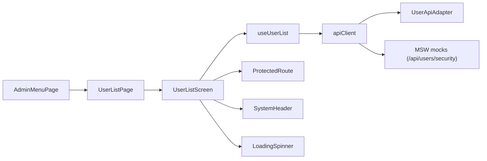

# 👤 USER - Módulo de Administración de Usuarios del Sistema

**Módulo ID**: `user`  
**Versión**: 1.0  
**Última actualización**: 2026-03-06  
**Propósito**: Permitir al equipo de administración controlar el ciclo de vida de los usuarios del sistema (back-office y admin) mediante listados, creación, edición y eliminación con validaciones y auditoría visual.

---

## 📋 Descripción General

El módulo USER se expone únicamente desde el menú administrativo (`getAdminMenuData` en `app/data/menuData.ts`) y está protegido detrás de `ProtectedRoute` con `requiredRole="admin"` en `App.tsx`. Combina cuatro pantallas full screen (`UserListPage`, `UserAddPage`, `UserUpdatePage`, `UserDeletePage`) que reutilizan los componentes visuales de la carpeta `app/components/user` y los hooks de negocio en `app/hooks/*`.

### Responsabilidades Principales
- Permitir búsquedas filtradas de usuarios (`useUserList`) y procesar acciones (Update/Delete) mediante selects con teclas funcionales replicando flujo COBOL (ENTER=continuar, F3=volver, F7/F8 paginación).
- Gestionar formularios de alta/actualización con validaciones estrictas de longitud y tipos (userId y password = 8 caracteres, userType ∈ {A,U}).
- Confirmar eliminaciones con diálogo, mostrar datos solo lectura y prevenir borrados accidentales.
- Consumir APIs mockeadas durante desarrollo (MSW) y adaptadores a backend real (`UserApiAdapter`).
- Registrar mensajes de estado (success/error/info) por medio de `Alert` y `SystemHeader`.

---

## 🔧 Arquitectura Técnica

### Componentes clave
1. **`UserListScreen.tsx`** (`app/components/user/UserListScreen.tsx`)  
   - `Material-UI Table` con `Select` por fila para elegir acción U/D, paginación manual y atajos de teclado (`F3`, `F7`, `F8`, `ENTER`).
   - `SystemHeader` + `LoadingSpinner` + `Alert` reutilizados, incluye copia visual de separadores del mainframe original.
2. **`UserAddScreen.tsx`**  
   - Formulario responsive con `TextField`, `Select` y botones `ENTER/F4/F3/F12`, validaciones inline tirando de `useUserAdd`.
3. **`UserUpdateScreen.tsx`**  
   - Búsqueda por `userId`, modo edición condicionado a datos válidos, `Dialog` de confirmación (`F5` para guardar, `F3` para guardar y salir).
4. **`UserDeleteScreen.tsx`**  
   - Vista lectura con chips/AW icons, confirmación modal, habilita `F5` sólo cuando existe `userData`.
5. **Hooks `useUserList` / `useUserAdd` / `useUserUpdate` / `useUserDelete`**  
   - Orquestan llamadas `useMutation`, `apiClient`, validaciones y navegación, detectan si se usan mocks (`VITE_USE_MOCKS`).
6. **`UserApiAdapter`** (`app/services/userApi.ts`)  
   - Traduce requests/responses entre UI y backend real o mocks, maneja adaptaciones (R → U, paginación, errores HTTP).

### Flujo de la pantalla principal



---

## 🌐 APIs y Contratos (Mock vs Backend real)

### Listado y acciones (`useUserList`)
- **Mock**: `GET /api/users/security` devuelve `users`, `pagination.hasNext`, `pagination.hasPrev` y se procesa con `userSelections` (Select U|D).  
- **Backend real**: `GET /users/list?pageNumber={n}&direction=FORWARD&startUserId={id}` a través de `UserApiAdapter.getUserList`.

### Alta de usuarios (`useUserAdd`)
- **Mock**: `POST /api/users/add`
- **Backend real**: `POST /users` con payload `{ userId, firstName, lastName, password, userType }` y respuesta `CreateUserResponseDto`.

### Actualización (`useUserUpdate`)
- **Mock**: `GET`/`PUT /api/users/security/:userId`
- **Backend real**: `GET /users/{userId}` + `PUT /users/{userId}` con validaciones de longitud y combinación (password debe tener exactamente 8 caracteres).

### Eliminación (`useUserDelete`)
- **Mock**: `DELETE /api/users/security/:userId`
- **Backend real**: `DELETE /users/{userId}` (UserApiAdapter encapsula `ApiResponse`).

### User Story Interface (ejemplo)

```json
{
  "userId": "USER123",
  "firstName": "ANA",
  "lastName": "NUNEZ",
  "password": "ABC12345",
  "userType": "U"
}
```

---

## 📊 Modelos de Datos (TypeScript)

```ts
// app/types/user.ts
export interface UserSecurityData {
  userId: string;
  firstName: string;
  lastName: string;
  userType: 'A' | 'U' | 'R';
}

// app/types/userAdd.ts
export interface UserAddRequest {
  userId: string;
  firstName: string;
  lastName: string;
  password: string;
  userType: string;
}

// app/types/userUpdate.ts
export interface UserUpdateData {
  userId: string;
  firstName: string;
  lastName: string;
  userType: 'A' | 'U';
  password?: string;
}
```

---

## 📋 Reglas de Negocio y Validaciones

1. `userId` y `password` deben ser texto de hasta 8 caracteres (update exige exactamente 8).  
2. `userType` sólo acepta `A` (admin) o `U` (user); en listados se normaliza `'R' → 'U'`.  
3. Solo admins pueden acceder al módulo (menu admin).  
4. Las acciones U/D se toman desde la selección de la tabla y se limpian automáticamente tras procesar.  
5. `useUserUpdate` calcula `hasChanges` comparando el formulario actual con datos salvados para evitar `PUT` sin cambios.  
6. `useUserAdd` muestra mensajes con `Alert` y limpia el formulario tras confirmación (F4 = Clear).  

---

## 🎯 Historias y Patrones de User Story

### Plantillas específicas
- **Simple (1-2 pts)**: “Como admin, quiero listar usuarios filtrando por `userId` para confirmar el rol antes de tomar una acción.”  
- **Medio (3-5 pts)**: “Como admin, quiero editar el rol de un usuario y guardar desde F5 (sin salir) para ajustar permisos rápidamente.”  
- **Complejo (5-8 pts)**: “Como auditor, quiero desactivar un usuario, borrar su registro y ver el mensaje de confirmación para completar la reversión de acceso.”  

### Complejidad
- Simple: Listar, navegar y filtrar usuarios (paginación F7/F8, selección ENTER).  
- Medio: Crear/Actualizar con validación y mensajes (usar `useUserAdd`, `useUserUpdate`).  
- Complejo: Flujos multi-tecla (F5 rueda de confirmación, F3 Save & Exit, F12 Exit) con adaptadores entre mocks y backend real.

### Criterios de aceptación recurrentes
- Autenticación: Solo admin puede acceder (ProtectedRoute + `user.role`).  
- Validación: Mostrar `Alert` con cada campo en error y no permitir `submit`.  
- Performance: `GET list` < 500 ms (MSW simula 300-800 ms).  
- Manejador de errores: Show `Alert` con mensaje de `UserApiAdapter` cuando la API devuelve error HTTP.

---

## ⚡ Factores de aceleración

- Reuse hooks `useUserList`/`useUserAdd`/`useUserUpdate`/`useUserDelete` para encapsular lógica de `useMutation`, validaciones y navegación.  
- Material-UI (`TextField`, `Select`, `Alert`, `Table`) y `SystemHeader` aceleran la consistencia visual.  
- `apiClient` + `UserApiAdapter` normalizan las llamadas reales vs mocks.  
- MSW `userListHandlers`, `userAddHandlers`, `userUpdateHandlers`, `userDeleteHandlers` permiten pruebas sin backend.  
- `getAdminMenuData` garantiza la exposición controlada y reutilizable desde `AdminMenuPage`.

---

## 🚨 Riesgos y Deuda Técnica

1. Las validaciones se repiten en UI y backend; si se cambia una regla (p. ej. password) se debe sincronizar `useUserAdd/useUserUpdate` con `UserApiAdapter`.  
2. No hay notificaciones globales; `Alert` locales pueden perderse en modales (plan: integrar `notistack` + `Snackbar`).  
3. Falta cobertura de tests unitarios para los hooks (current coverage <70%); agregar tests con Vitest + React Testing Library.  

---

## ✅ Tareas y Seguimiento

- [x] Documentar flujo de teclas inspirado en COBOL.  
- [x] Enumerar endpoints reales y mocks.  
- [ ] Añadir validaciones de backend en documentos de contrato.  
- [ ] Implementar notificaciones globales y tests de hooks.  

---

## 🔄 Dependencias

- `ProtectedRoute` + `authSlice` (módulo Auth) para validar sesión/rol.  
- `SystemHeader`, `LoadingSpinner`, `Alert` y `Menu` compartidos con otros módulos.  
- `Material-UI (MUI) 5` para controls visuales.  
- `apiClient` y `UserApiAdapter` para la capa HTTP.  
- MSW mocks para test y desarrollo local.

---

## 🧭 Secuencia recomendada de historia

1. Validar login admin y navegación al menú de administración.  
2. Empezar con User List (filtros + acciones).  
3. Implementar alta y edición en paralelo (mismas validaciones).  
4. Agregar confirmación y borrado con diálogo y F5.  
5. Ajustar adaptadores cuando el backend real esté disponible (sin mocks).

